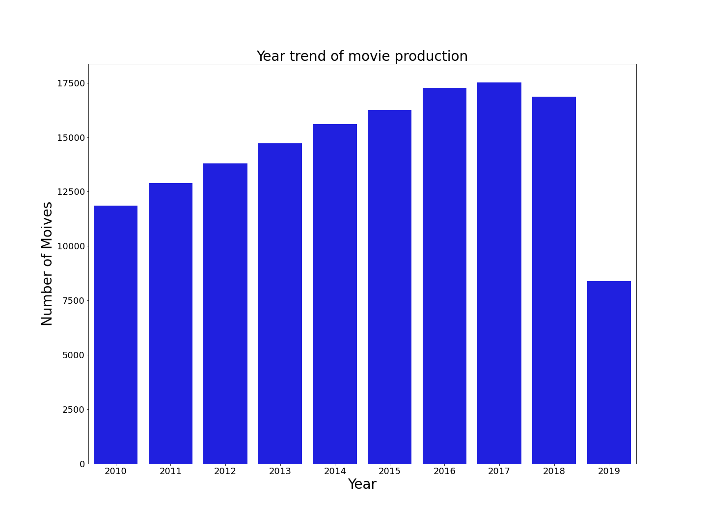

# Project 1: Movie Industry Analysis

## Project Description
For this project, I am tasked with exploring the movie industry data and analyzing movie data to assist Microsoft in their venture into the movie industry.  

## Data
I utilized four different data sources for my analysis in order to achieve a comprehensive view of the movie industry. 
-	IMDb.title.basics
-	Bom.movie.gross
-	Tn.moive.Budgets
-   Tmdb.movies

All the data can be found in **zippedData folder**

## Question 1:  How is the movie industry over the past fews years?

Tring to find answers for this big question, I split it into two more specific questions.

### The year trend of film production.

The data came from **IMDb.title.basic.csv file**. For the data behind this analysis, I used panda to group the data by the year and count the number of the film production for each year. From the beginning year 2010 to 2019, the film production versus time was plotted as below.



### What is the gross revenue of other mainstream movie studios in the industry?

Second, I looked at gross revenue of the other main movie studios in the industry. The data is from **bom.moive_gross.csv**. To start data cleaning, I dropped all missing values of studio and domestic gross, since their missing value ratio is only 1.4% and 0.8%. The missing values of foreign gross is almost 40%. Obviously, dropping all of them is not an option. After did some research about those movies’ foreign gross, most of them are not released globally. It does make sense that I chose to fill all the missing value of foreign gross as 0. After another round of data cleaning for foreign gross data (replaced “,” in the numbers and changed data type from object to float), I had the total gross column derived from domestic gross plus foreign gross. For this question, I focused on the Top 10 movie studios total gross revenue. From here, I got the following chart and Figure.


### Key findings:

- From 2010 to 2017, the number of film production gradually increased. In 2018, the number was slightly decreased. At the end of 2019, the film production dropped dramatically, which was only half of the previous year. 2020, because of the pandemic, The number of film production hit a record low. Statistically, the data for 2020 is not included in this figure. 


- 7 out of 10 movie studios worldwide gross revenue reached billions dollars level. It can be seen that the movie industry has considerable market value. Investing in a movie studio should be a good recipe for success.

## Question 2: What are the top 10 most popular movie genres? What is the count of genres by year?

The data came from **IMDb.title.basic.csv** file. To clean the data, I first dropped the ‘runtime_munutes, ‘original_title’ columns that I don’t need. Then I found that only 3.7% of genres data is missing, therefore, I chose to drop all the missing data. Next, I also dropped ‘tconst’ column to further clean the data set. 


All the columns names are self explanatory. As seen in the above dataframe, the genre column has data with comma separators which cannot be processed for recommendations as such. Hence, I need to generate columns for every genre type such that if the movie belongs to that genre it value will be 1 otherwise 0. After a few rounds of data processing, I created a new data frame with columns of each genre. For each movie, if the movie belongs to that genre, the value will be 1. 


Finally, I summed each columns and sorted values by descending to have the top ten most popular movie genres.  


For the second part of the question, I only kept top 10 popular movie genres and tried to see how their counts vary by year. In order to do that, I dropped all the columns of movies genres which are not in the top 10 group. After joined another dataframe with start_year by movies name, I got a new dataframe having all the data that I need. 


Grouped the data by start_year and summed all the columns by each movie genres. From there, I was able to compile the following chart.


Based the above data, the plot of count of top 10 movie genres by year is presented by the following figure. 


### Key findings:

- According to the data, over 50000 movie genres preferred documentaries over all other genres, followed by drama and comedy. All other movie genres were approximately 10000 and under. 


- From 2010 to 2018, most of movie genres are slowly growing except documentary and biography. Although documentary has a distinct decrease from 2017 to 2018, it is still the second most popular movie genre under the top 1 Drama in 2018. Biography started to lose its popularity from 2014. When the year reached 2019, biograph became the least popular among the top 10 movie genres.


## Question 3:  What is top 10 profitable movies over the past 10 years and what is the ROI for each of them? 

The data came from tn.moive.budges.csv file. I started with replacing ‘$’ and ‘,’ of all the data in production_budget, domestic_gross and worldwide_gross columns by “” and then changing the data type from string to integer. In order to get movie profit, I created another column with the data from worldwide_gross minus production_budget. Furthermore, I also explore the ROI for the top 10 profitable movies. I created RIO column with the data calculated from movie profit divide by production_budget.


## Question 4:What is the relationship between most profitbal movies and audience ratings scores?

After finding the top 10 profitable movies over the past 10 years, I want to see the relationship between them and their audience ratings. I started with creating a new dataframe only with top 10 profitable movies. And then dropped all the columns that I don’t need. From there, I got the following chart.


For the movie ratings, the data from **tmdb.movies.csv**. The first step, I also dropped the columns that I don’t need. Then, I did right join for above movie_profit and movie_ratings dataframes by index. 


As seen from above chart, there are missing values, which are very important information that needs to fill. After looking for each of them from the web, I filled the right information for each missing value. 


Based on the data of the above chart, the following figure shows the relationship between movie profit and audience ratings.


### Key findings:

- Among the top 10 most profitable movies, superhero movies are a mix of genres and dominated the top 10 for profit.


- All of top 10 movies have over 500% ROI (Return on Investment), which is supper successful. The most successful movies are titanic and harry potter with highest ROI in history. They were an international sensation. 


- Nearly all these successful movies are a mix of adventure, action and fantasy genres. 


- There is no direct correlation between box office sales and movie scores. However, if we want to ensure a spectacular box office success, the audience average rating tends to be above 6.5.

## Recommendations

- Based on the past few years of data, it shows that investing movie industry should be a good recipe for success. The only limitation is that we are in a global pandemic. However, more and more people are joining streaming platforms, I believe that the film industry will be back on track.


- Choosing right genres for a movie is significantly important. More and more people are no longer satisfied with a single movie genre. A good combination of different movie genres like drama, comedy, action, adventure and fantasy is the key factor in the success of a movie at the box office.


- Superhero movies were super successful in the past few years. Although they all required huge investment, the return on investment is very impressive.


- A high score of audience rating is not a necessary factor for the success of a movie in box office. However,  if you want to ensure a spectacular box office success, the baseline of the audience rating score should reach 6.5 or above that.


## Future Work

- One of the future research areas would be to see how much money can make if the movies are released on a streaming platform like Netflix. With the pandemic, movie theaters may not be as profitable as before. It would be a good idea to look at investing movies for streaming audience.


- Another research area would be to see any correlation between those most profitable movies and movie production staff, including directors and actors.


- I would also be interested in exploring the relationship between movie run time and movie profit for different movie genres. 


```python

```
